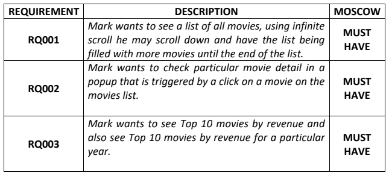

# Front End - Challenge
Frontend Challenge, using React to make a very simple movie app. 

The **app** should have the following visual [aspect](https://xd.adobe.com/view/ea7b4a6b-b5b4-40cf-8d34-fffd1ed91d8c-bf28/specs/).

The **app** requires the following functionalities:



These will later on be detailed in this file.

The project runs on **Node.js** [v16.13.1](https://nodejs.org/dist/v16.13.1/node-v16.13.1-x64.msi), scaffolded using the **create-react-app** [module](https://create-react-app.dev/docs/getting-started).

To run the project in development mode, open the repository and simply type in your terminal:
````
cd marksapp 
npm start
````

Internet access is required for the app to communicate with the [API](http://movie-challenge-api-xpand.azurewebsites.net/swagger-ui/index.html?configUrl=/v3/api-docs/swagger-config#/), at least once if it gets stored in your browser cache.
